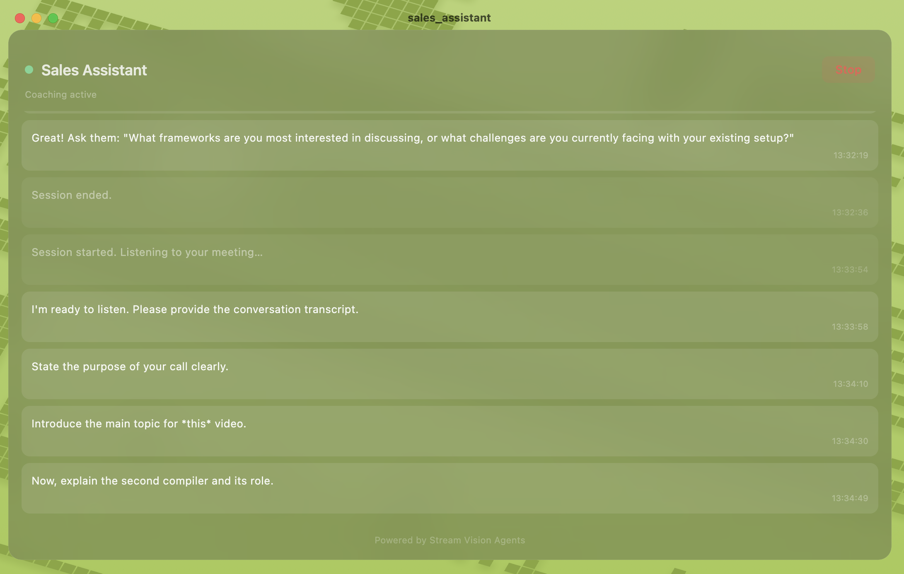

# Realtime Sales Assistant



A real-time AI meeting coach that lives on your desktop as a translucent macOS overlay. It silently listens to your microphone and system audio during meetings, interviews, and sales calls — transcribes the conversation, analyzes the dialogue, and surfaces coaching suggestions directly on screen. Invisible to other participants.

Built by the [Vision Agents](https://github.com/GetStream/vision-agents) team at [Stream](https://getstream.io). This repo contains the macOS desktop app. The accompanying Python agent backend lives in the [sales assistant example](https://github.com/GetStream/Vision-Agents/tree/main/examples/09_sales_assistant_example) of the main Vision Agents repo.

## Quick Start (Pre-built Binary)

A compiled macOS binary is available on the [Releases](https://github.com/GetStream/vision-agents-sales-assistant-demo/releases) page.

1. Download the latest `.dmg` or `.zip` from the releases page.
2. Move the app to your **Applications** folder (or wherever you prefer).
3. Double-click to open. **macOS will likely block the first launch** with a message like _"Sales Assistant can't be opened because Apple cannot check it for malicious software."_ — this is expected for unsigned builds.
4. Open **System Settings → Privacy & Security**, scroll down, and click **Open Anyway** next to the Sales Assistant entry.
5. Launch the app again. You may see one more confirmation dialog — click **Open**.
6. Start the [Python agent backend](#backend) and click **Start** in the overlay to begin a coaching session.

## Architecture

| Component | Description |
|-----------|-------------|
| **macOS App** (this repo) | Translucent Flutter overlay that captures mic + system audio via a Stream Video call and displays the agent's coaching suggestions |
| **Python Agent** ([Vision Agents example](https://github.com/GetStream/Vision-Agents/tree/main/examples/09_sales_assistant_example)) | Joins the Stream Video call, transcribes audio with AssemblyAI (with speaker diarization), analyzes transcripts with an LLM, and sends coaching text back via Stream Chat |

**Flow:**

1. User opens the macOS overlay and clicks **Start**.
2. The app creates a Stream Video call with screen sharing (including system audio capture).
3. The app tells the Python agent server to join the call.
4. The agent transcribes audio and generates coaching suggestions.
5. Suggestions appear as text on the translucent overlay via Stream Chat.

## API Keys

- **Stream** — This app uses [Stream](https://getstream.io) for real-time video and chat. Get a free API key from the [Stream Dashboard](https://getstream.io/try-for-free/).
- **Backend** — The Vision Agents backend supports pluggable LLM providers (e.g. Gemini, OpenAI, Claude). Configure your chosen provider and its API keys in the backend; the macOS app only talks to your agent server.

## Backend

The app expects the agent server to be running (default `http://localhost:8000`). You can change this URL in the app's settings screen.

Clone the [Vision Agents repo](https://github.com/GetStream/Vision-Agents) and follow the setup instructions in the [sales assistant example](https://github.com/GetStream/Vision-Agents/tree/main/examples/09_sales_assistant_example):

```bash
cd Vision-Agents/examples/09_sales_assistant_example
cp .env.example .env
# Fill in your Stream, Gemini, and AssemblyAI API keys in .env

uv sync
uv run main.py serve
```

The server will listen on `http://localhost:8000`. Ensure it is running before launching the macOS app.

---

## Development Setup

### Prerequisites

| Requirement | Version |
|-------------|---------|
| macOS | 13.0+ |
| Flutter | 3.32+ |
| Dart | 3.8+ |
| Xcode | Latest stable with macOS development enabled |
| CocoaPods | Latest (`sudo gem install cocoapods`) |

### Clone and Install

```bash
git clone https://github.com/GetStream/vision-agents-sales-assistant-demo.git
cd vision-agents-sales-assistant-demo

flutter pub get
cd macos && pod install && cd ..
```

### Run

```bash
flutter run -d macos
```

### Build a Release Binary

```bash
flutter build macos
```

The built app bundle will be in `build/macos/Build/Products/Release/`.

### Project Structure

```
lib/
├── main.dart                  # Entry point, window initialization, settings
├── overlay_app.dart           # Root app widget, Stream Video/Chat setup
├── overlay_screen.dart        # Main overlay UI — start/stop, suggestions, context
├── settings_screen.dart       # Agent server URL configuration
├── settings_service.dart      # SharedPreferences-based settings persistence
├── agent_service.dart         # HTTP client for the Vision Agents backend
└── audio_device_selector.dart # Audio device picker

macos/
├── Runner/
│   ├── MainFlutterWindow.swift   # Floating translucent overlay window config
│   ├── AppDelegate.swift
│   ├── DebugProfile.entitlements # Sandbox + mic/camera/network entitlements
│   ├── Release.entitlements
│   └── Info.plist
└── Podfile                       # CocoaPods config (platform :osx, '13.0')
```

### Key Dependencies

| Package | Purpose |
|---------|---------|
| `stream_video_flutter` | Video and audio calls via Stream |
| `stream_video_screen_sharing` | Screen sharing with system audio capture |
| `stream_chat` | Receiving agent coaching suggestions |
| `macos_window_utils` | Transparent floating overlay window |
| `shared_preferences` | Persisting app settings |
| `http` | HTTP requests to the agent server |

The project uses a [custom fork of `stream_webrtc_flutter`](https://github.com/GetStream/webrtc-flutter/tree/feature/macos-screen-audio-capture) to enable macOS screen + system audio capture. This is configured as a dependency override in `pubspec.yaml`.

### macOS Entitlements

The app requires the following entitlements (already configured):

- **App Sandbox** — enabled
- **Microphone** — captures meeting audio
- **Camera** — video call support
- **Network Client/Server** — communicates with the agent backend and Stream services

### Notes

- The overlay window is configured as a floating panel (420×640) anchored to the bottom-right of the screen and is hidden from screen capture by default. There is a toggle in the UI to make it visible to screen capture if needed.
- The agent server URL defaults to `http://localhost:8000` and can be changed from the settings screen within the app.
